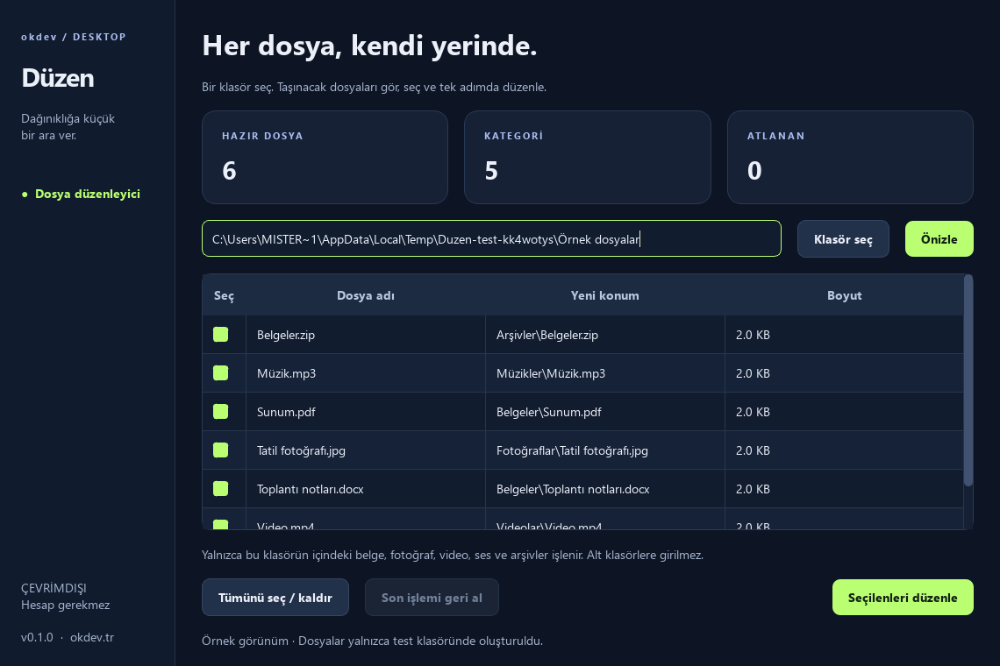

# Düzen

**Dosyalarını önce gör, sonra düzenle.** Türkçe ve çevrimdışı Windows masaüstü uygulaması.

[Windows için indir](https://github.com/okdev01/duzen/releases/download/v0.1.0/Duzen-0.1.0-Windows-x64.zip) · [Tüm sürümler](https://github.com/okdev01/duzen/releases) · [English summary](#english)



## Kullanım

1. ZIP dosyasını indir ve tamamını bir klasöre çıkar.
2. Klasördeki **Duzen.exe** dosyasını aç. Python kurulumu gerekmez.
3. **Klasör seç** ile düzenlemek istediğin klasörü belirle.
4. Önizlemeyi incele; istemediğin dosyaların seçimini kaldır.
5. **Seçilenleri düzenle** düğmesine basıp taşımayı onayla.
6. Gerektiğinde **Son işlemi geri al** düğmesiyle dosyaları eski yerine getir.

`_internal` klasörünü EXE'nin yanında tut. Program taşınabilir pakettir; kurulum,
hesap, internet bağlantısı veya yönetici izni istemez. Kullanıcının seçtiği konumun
normal dosya izinleri geçerlidir.

## Neleri yapar?

- Belgeleri, fotoğrafları, videoları, sesleri ve arşivleri ayrı klasörlere taşır.
- Yalnızca seçtiğin klasörün doğrudan içindeki dosyalarla çalışır.
- Aynı adlı dosyalar için numaralı yeni ad önerir; mevcut dosyayı değiştirmez.
- Önizlemeden sonra değişen dosyaları işlemden çıkarır.
- Her işlemi yerel geçmişe kaydeder; uygulama yeniden açıldıktan sonra da geri alma kullanılabilir.
- Geri alma sırasında dosya değişmişse veya eski konum doluysa üzerine yazmadan atlar.

## Veriler ve sınırlar

İşlem kayıtları `%LOCALAPPDATA%\OkdevDesktop\Duzen\history` altında saklanır ve
dosya yollarını içerir. Geçmişi silmek geri alma bilgisini kaldırır. Geri alma bir
yedekleme sistemi değildir; düzenlenen dosyanın içerik değişikliğini geri çevirmez.
Değişiklik kontrolü dosya kimliği, boyut ve son yazma zamanına dayanır.

Gizli/sistem dosyaları, bağlantılar, program dosyaları ve tanınmayan uzantılar
atlanır. Alt klasörler taşınmaz. Yerel Windows diskleri hedeflenmiştir; ağ paylaşımı,
eşzamanlı bulut senkronizasyonu ve bozuk işlem kayıtlarının kurtarılması doğrulanmadı.
Boş kategori klasörleri geri alma sonrasında kalabilir. Paket kod imzalı değildir.

## Kaynaktan çalıştırma ve test

```powershell
python -m venv .venv
.\.venv\Scripts\python -m pip install -r requirements-build.txt
.\.venv\Scripts\python main.py
.\.venv\Scripts\python -m unittest -v
.\.venv\Scripts\python main.py --smoke-test smoke-result.json --preview preview.png
.\.venv\Scripts\python build.py
```

Python 3.14 ve Windows x64 kullanılır. Arayüz test modu geçici örnek dosyalarla,
görünmez Qt ortamında çalışır. Kullanıcının gerçek dosyalarına dokunmaz.
10 davranış testi; önizleme, ad çakışması, değişen dosyalar, çökme sonrası geri alma
ve hedef klasör kontrolünü kapsar. Paketli EXE ayrıca otomatik işlev kontrolünden geçirilir.

## English

A preview-first Windows file organizer with a Turkish Qt interface, collision-safe
moves and a persistent undo journal. Offline, with no account or runtime Python
installation required. Source, tests and reproducible packaging are included.

MIT · [Orçun Kara / okdev](https://okdev.tr). Dependency licenses: [THIRD_PARTY_NOTICES.txt](THIRD_PARTY_NOTICES.txt).
